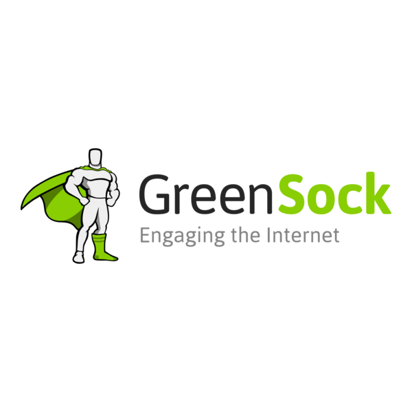
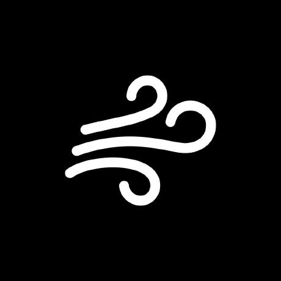

  

<h3 align="center">Building seamless web & mobile experiences. Always learning, experimenting, and creating every day.</h3>

---

## About Me
I’m a **passionate developer** focused on **interactive, clean, and scalable apps**.  
I enjoy exploring **modern web & mobile technologies**, experimenting with **AI features**, and **learning new tools every day**.

---

## Tech Stack

  
  
  
  
  
  
  
  
  
  
  
  
  
  
  

---

## Featured Projects
| Project | Tech |
|---------|------|
| **ReferIn** – Referral marketplace | Next.js, Supabase, Clerk, Stripe |
| **Risus** – Social app with AI reposts & tokens | React Native (Expo) |
| **Coffee App** – Coffee ordering app | React Native, Tailwind |
| **Natgrove** – Eco-awareness reward app | Expo, Supabase |
| **VectorX** – SaaS data visualization | Next.js, Supabase |

---

## GitHub Stats

  
  

---

## Connect With Me

  
  
  

